# YakTech OPN Automation Architecture Report

## 1. System Overview

This document outlines the architecture of the YakTech Open Negotiation (OPN) Automation platform. 
As of **January 2026**, the system has been consolidated into a **Unified Service Architecture**, moving from a 3-service model to a streamlined 2-service model to enhance scalability and reduce maintenance overhead.

## 2. High-Level Architecture

The system consists of three primary components:
1.  **Frontend (UI):** React-based user interface for real-time interaction.
2.  **Repo (Unified Brain):** The central core handling Intelligence, Routing, and Orchestration.
3.  **OPN-Agent (Worker):** Specialized execution engine for document processing.

### Architecture Diagram

```mermaid
graph TB
    User[👤 User / Browser] -->|1. Chat/Request| UI[🖥️ Frontend UI<br/>Port 3000]
    UI -->|2. Send Query| Repo[🧠 Repo Service<br/>(Router + Orchestrator)<br/>Port 8001]
    
    subgraph "Repo (The Brain)"
        Repo <-->|Search| Qdrant[(Vector DB)]
        Repo <-->|Query| LLM[Grok LLM]
        Repo <-->|Lookup| DB[(PostgreSQL)]
    end
    
    subgraph "Execution Layer"
        Repo -->|3. Auto-Execute| OPN[⚙️ OPN-Agent<br/>Port 8000]
        OPN -->|4. Generate| Docs[📄 Docs & Reports]
    end
    
    style UI fill:#3498db,stroke:#2980b9,color:#fff
    style Repo fill:#e67e22,stroke:#d35400,color:#fff
    style OPN fill:#2ecc71,stroke:#27ae60,color:#fff
```

## 3. End-to-End Workflow

The following sequence diagram illustrates the lifecycle of a request in the unified architecture. The "Orchestrator" is no longer a separate hop; it is an internal logic flow within Repo.

```mermaid
sequenceDiagram
    participant U as 👤 User (UI)
    participant R as 🧠 Repo (8001)
    participant A as ⚙️ OPN-Agent (8000)
    participant F as 📁 File System

    Note over U,F: Step 1: Request Initiation
    U->>R: POST /process/process<br/>"Create CEP Wave 6 docs"
    
    Note over U,F: Step 2: Intelligent Routing (Internal)
    R->>R: Analyze & Classify Intent (LLM)
    R->>R: Extract Params (Client=CEP, Wave=6)
    R->>R: Lookup "Open Negotiation Agent"<br/>in Database to find Endpoint
    
    Note over U,F: Step 3: Orchestration (Internal)
    R->>R: Auto-resolve files (Excel, Template)<br/>using matching patterns
    R->>R: Construct Payload for Agent
    
    Note over U,F: Step 4: Execution
    R->>A: POST /run-advanced-workflow
    A->>A: Run Sub-Agents (Group, Notice, Merge)
    A->>F: Read Inputs & Write Outputs
    A-->>R: Return Results & Stats
    
    Note over U,F: Step 5: Completion
    R-->>U: Final Combined Response
    U->>U: Display "Task Completed"
```



## 4. Component Details

### 🖥️ Frontend UI (Port 3000)
- **Tech Stack:** React 19, Vite, Tailwind CSS, TypeScript.
- **Function:** Provides a chat interface for users to naturally interact with the system.

### 🧠 Repo Service (Port 8001) - *The Unified Brain*
- **Tech Stack:** Python FastAPI, Supabase (PostgreSQL), Qdrant (Vector DB), Grok LLM, HTTPX.
- **Roles:**
    1.  **Router:** Uses RAG + LLM to classify user intent and route to specific agents.
    2.  **Orchestrator:** Manages the execution flow, resolves dependencies (files), and calls downstream agents.
    3.  **Registry:** Stores agent configurations (Endpoints, Capabilities) in PostgreSQL.
- **Key Modules:**
    - `api/chat.py`: Routing intelligence.
    - `api/process.py`: Unified entry point.
    - `services/orchestration_service.py`: Execution logic.
    - `services/file_resolver.py`: File pattern matching.

### ⚙️ OPN-Agent (Port 8000) - *The Worker*
- **Tech Stack:** Python FastAPI, Semantic Kernel, Pandas.
- **Function:** Dedicated worker for heavy-duty document processing.
    - **Note:** This service is "dumb" - it just executes complex tasks when told by Repo.
    - **Capabilities:** Excel grouping, Word notice generation, PDF merging.

## 5. Deployment Specs

| Service | Port | URL | Role |
|---------|------|-----|------|
| **UI** | 3000 | `http://localhost:3000` | User Interface |
| **Repo** | 8001 | `http://localhost:8001` | **Unified Brain** (Routing + API Gateway) |
| **OPN-Agent** | 8000 | `http://localhost:8000` | Worker / Execution Engine |

---
**Generated by Yakkay AI Agent**
*Document Version: 2.0 (Consolidated)*
