# YakTech OPN Automation Architecture Report

## 1. System Overview

This document outlines the architecture of the YakTech Open Negotiation (OPN) Automation platform, a microservices-based system designed to automate healthcare document generation workflows using AI agents.

## 2. High-Level Architecture

The system consists of four primary components:
1.  **Frontend (UI):** React-based user interface for real-time interaction.
2.  **Orchestrator:** Middleware service handling coordination and file resolution.
3.  **Repi (Router):** AI-powered routing engine using RAG and LLMs.
4.  **OPN-Agent:** Execution engine for document processing.

```mermaid
graph TB
    User[👤 User / Browser] -->|1. Chat via UI| UI[🖥️ Frontend UI<br/>Port 3000]
    UI -->|2. Send Query| Orch[🎼 Orchestrator<br/>Port 8002]
    
    subgraph Routing Intelligence
        Orch -->|3. Get Routing| Repi[🧠 Repi Router<br/>Port 8001]
        Repi <-->|Search| Qdrant[(Vector DB)]
        Repi <-->|Query| LLM[Grok LLM]
    end
    
    subgraph Execution Intelligence
        Orch -->|4. Dispatch Command| OPN[⚙️ OPN-Agent<br/>Port 8000]
        OPN -->|5. Generate| Docs[📄 Docs & Reports]
    end
    
    style UI fill:#3498db,stroke:#2980b9,color:#fff
    style Orch fill:#9b59b6,stroke:#8e44ad,color:#fff
    style Repi fill:#e67e22,stroke:#d35400,color:#fff
    style OPN fill:#2ecc71,stroke:#27ae60,color:#fff
```

## 3. End-to-End Workflow

The following sequence diagram illustrates the complete lifecycle of a user request, from the initial chat message to the final delivery of generated documents.

```mermaid
sequenceDiagram
    participant U as 👤 User (UI)
    participant O as 🎼 Orchestrator (8002)
    participant R as 🧠 Repi Router (8001)
    participant A as ⚙️ OPN-Agent (8000)
    participant F as 📁 File System

    Note over U,F: Step 1: Request Initiation
    U->>O: POST /process<br/>"Create CEP Wave 6 docs"
    
    Note over U,F: Step 2: Intelligent Routing
    O->>R: POST /chat/chat
    R->>R: Analyze & classify intent
    R->>R: Extract params (Client=CEP, Wave=6)
    R-->>O: Return Routing Decision<br/>{agent: OPN, context: {...}}
    
    Note over U,F: Step 3: Orchestration & File Resolution
    O->>O: Resolve file paths based on context
    O->>O: Construct payload for agent
    
    Note over U,F: Step 4: Execution
    O->>A: POST /run-advanced-workflow
    A->>A: Run Sub-Agents (Group, Notice, Merge)
    A->>A: Convert numpy types to native JSON
    A->>F: Read Inputs & Write Outputs
    A-->>O: Return Results & Stats
    
    Note over U,F: Step 5: Completion
    O-->>U: Final Success Response
    U->>U: Display "Task Completed"
```

## 4. Component Details

### 🖥️ Frontend UI (Port 3000)
- **Tech Stack:** React 19, Vite, Tailwind CSS, TypeScript.
- **Function:** Provides a chat interface for users to naturally interact with agents. Streaming response support.

### 🎼 Orchestrator Service (Port 8002)
- **Tech Stack:** Python FastAPI.
- **Function:** The central nervous system.
    - **Middleware:** Bridges frontend and backend agents.
    - **Protocol Resolver:** Translates natural language intent into structured API calls.
    - **File Resolver:** Smartly mapping "CEP Wave 6" to physical file paths `D:/Data/Input/CEP_W6.xlsx`.

### 🧠 Repi Router (Port 8001)
- **Tech Stack:** Python FastAPI, Supabase (PostgreSQL), Qdrant (Vector DB), Grok LLM.
- **Function:** Intelligence layer.
    - **RAG:** Retrieves agent capabilities to match queries.
    - **LLM Reasoning:** Uses Llama-3 (via Grok) to extract parameters.

### ⚙️ OPN-Agent (Port 8000)
- **Tech Stack:** Python FastAPI, Semantic Kernel, Pandas.
- **Function:** Worker layer.
    - **Multi-Agent:** Coordinator, GroupGenerator, NoticeGenerator.
    - **Processing:** Handles Excel data manipulation and PDF generation.

## 5. Deployment Specs

| Service | Port | URL | Role |
|---------|------|-----|------|
| **UI** | 3000 | `http://localhost:3000` | User Interface |
| **Orchestrator** | 8002 | `http://localhost:8002` | API Gateway / Middleware |
| **Repi Router** | 8001 | `http://localhost:8001` | Routing Intelligence |
| **OPN-Agent** | 8000 | `http://localhost:8000` | Execution Engine |

---
**Generated by Yakkay AI Agent**
*Document Version: 1.0*
